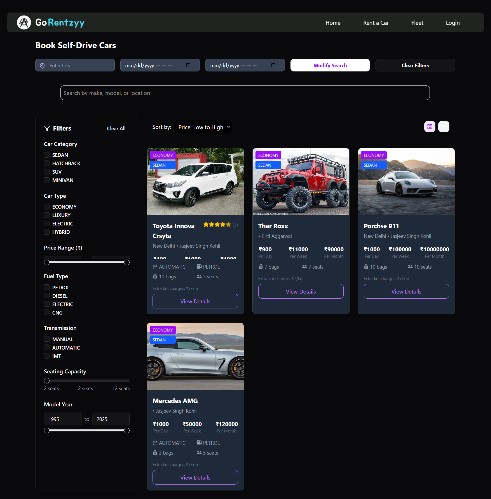

````markdown
# 🚗 GO Rentzyy: The Car Rental SaaS

<p align="center">
  
</p>

> A full-featured **peer-to-peer car rental platform** connecting **Hosts (lenders)** and **Renters (borrowers)**.  
> It delivers a **secure, scalable, and user-friendly** experience with real-time availability, location-based filters, payments, and admin controls.

---

## 📖 About

GO Rentzyy is a SaaS-based **Car Rental Platform** that bridges the gap between vehicle owners and renters.  
It ensures **security, flexibility, and transparency** in the rental process with:

- 🔒 **User Authentication & Authorization** (JWT + OAuth with Google & GitHub)
- 🚘 **Car Listings & Booking Management**
- 📍 **Location-based Search with Google Maps**
- 💰 **Dynamic Pricing & Razorpay Payment Gateway**
- 📝 **Rental Agreement Handling**
- 📨 **Email & SMS Notifications (Twilio)**
- 📦 **Containerization (Docker)**
- 🔎 **ElasticSearch for optimized search**
- ☁️ **Cloudinary for media storage**
- 📊 **Admin Dashboard with health metrics (Spring Actuator)**
- ✅ **Unit Testing with JUnit & Mockito**

---

## 🖼️ Screenshots

<p align="center">
  
</p>

<p align="center">
  
</p>

---

## ⚙️ Tech Stack

### 🖥️ Frontend (Next.js)
- **Framework**: Next.js 15 (App Router)  
- **Styling**: Tailwind CSS + Radix UI + Framer Motion  
- **State Management**: Zustand  
- **Authentication**: NextAuth.js (Google/GitHub OAuth)  
- **UI Components**: shadcn/ui, Lucide Icons, Embla Carousel  
- **API Integration**: Axios  
- **Maps**: @react-google-maps/api  
- **Charts**: Recharts  

### ⚡ Backend (Spring Boot)
- **Core**: Spring Boot (REST APIs)  
- **Security**: JWT Auth + OAuth2 (Google, GitHub)  
- **Scheduling**: Spring Scheduler for rentals/notifications  
- **Payments**: Razorpay integration  
- **Storage**: Cloudinary for images/videos  
- **Database**: PostgreSQL (local) + Supabase (production)  
- **Search**: ElasticSearch  
- **Notifications**: Email (SMTP) + Twilio SMS/OTP  
- **Docs**: Swagger UI  
- **Health Metrics**: Spring Actuator  
- **Testing**: JUnit + Mockito  
- **Containerization**: Docker + docker-compose  

---

## 📂 Directory Structure

```bash
jasjeev013-gorentzyy/
├── client/                 # Next.js Frontend
│   ├── app/                # Next.js App Router
│   ├── components/         # Reusable UI components
│   ├── hooks/              # Custom React hooks
│   ├── public/             # Static assets (logo, screenshots, images)
│   ├── stores/             # Zustand stores
│   └── utils/              # Utilities (razorpay config, helpers)
│
├── server/                 # Spring Boot Backend
│   ├── src/main/java/...   # Java source code
│   │   ├── controllers/    # REST Controllers
│   │   ├── services/       # Business Logic
│   │   ├── repositories/   # JPA Repositories
│   │   ├── models/         # Entity Models
│   │   └── config/         # Security & App Configs
│   ├── src/test/java/...   # Unit Tests (JUnit, Mockito)
│   ├── pom.xml             # Maven dependencies
│   ├── Dockerfile          # Docker containerization
│   └── docker-compose.yml  # Compose for DB & services
│
├── resources/
│   └── Car Rental System.docx   # Project Documentation
│
└── README.md               # This file
````

---

## 🚀 Getting Started

### 🔧 Prerequisites

* Node.js (v20+)
* Java 21 + Maven
* PostgreSQL
* Docker (optional for containerization)

---

### 🖥️ Frontend Setup (Next.js)

```bash
cd client
npm install
npm run dev
```

Runs the app in development mode on **[http://localhost:3001](http://localhost:3001)**

---

### ⚡ Backend Setup (Spring Boot)

```bash
cd server
./mvnw spring-boot:run
```

Runs the backend on **[http://localhost:8080](http://localhost:8080)**

Swagger Docs available at: **[http://localhost:8080/swagger-ui.html](http://localhost:8080/swagger-ui.html)**

---

### 🗄️ Database (Postgres + Supabase)

* Configure local DB in `application.properties`
* For production, Supabase connection details are in `application-prod.properties`

---

### 🐳 Docker Setup (Optional)

```bash
docker-compose up --build
```

---

## 🧪 Testing

Run unit tests with:

```bash
cd server
./mvnw test
```

Generates test coverage reports in `/htmlReport/`.

---

## 📌 Features Roadmap

* [x] Car Listing & Rental Booking
* [x] Secure Authentication (JWT, OAuth)
* [x] Payment Gateway (Razorpay)
* [x] Location Tracking (Google Maps)
* [x] Cloud Storage (Cloudinary)
* [ ] Mobile App (React Native)
* [ ] Advanced Analytics Dashboard

---

## 🤝 Contributing

Contributions are welcome! 🎉
Fork the repo, create a new branch, and submit a PR.

---

## 📜 License

This project is licensed under the **MIT License**.

---

<p align="center">Made with ❤️ by <b>jasjeev013</b></p>
```

---

👉 Do you also want me to create **badges** (e.g., build passing, license, Next.js, Spring Boot, PostgreSQL, Docker) at the top of the README for extra polish?
